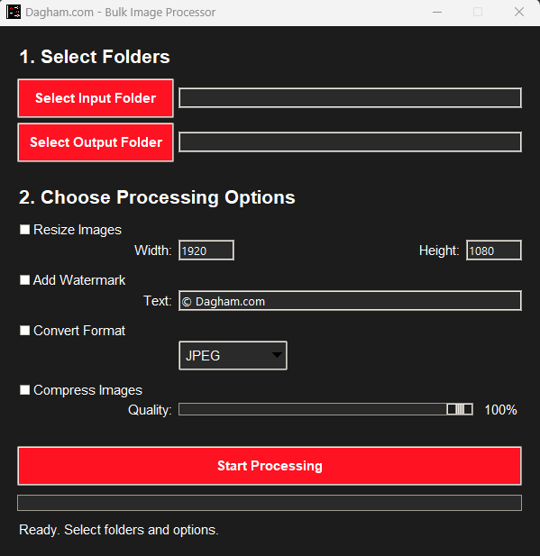

# Bulk Image Processor (Python & Tkinter)

A user-friendly desktop application built with Python for batch processing images. This tool empowers users to efficiently resize, compress, add watermarks, and convert the format of entire folders of images, saving significant time compared to manual editing.

---

## 🌟 About The Project

In many workflows, both professional and personal, there's a need to process multiple images with the same set of edits. Doing this manually is tedious, repetitive, and prone to error. This Bulk Image Processor was created to solve that exact problem by providing a simple, powerful, and intuitive GUI application to automate these tasks.

The application is built entirely with standard Python libraries, making it lightweight and easy to run on any major operating system.

### ✨ Key Features

-   🖼️ **Batch Processing:** Apply edits to thousands of images in a single run.
-   📏 **Image Resizing:** Standardize image dimensions with custom width and height.
-   💧 **Text Watermarking:** Automatically add a customizable text watermark to protect your work.
-   🔄 **Format Conversion:** Convert between **JPEG, PNG, WEBP, GIF, and BMP**.
-   🗜️ **Smart Compression:** Reduce file size with an adjustable quality slider.
-   🎨 **Custom Branded UI:** A sleek, modern dark-themed interface built with Python's native **Tkinter** library.
-   🖥️ **Cross-Platform:** Runs on Windows, macOS, and Linux.

---

## 🛠️ Built With

This project leverages the power of core Python libraries to deliver a robust user experience.

* [**Python**](https://www.python.org/) - The core programming language.
* [**Tkinter**](https://docs.python.org/3/library/tkinter.html) - For the native graphical user interface (GUI).
* [**Pillow (PIL Fork)**](https://python-pillow.org/) - For all image manipulation and processing tasks.

---

## 📸 Screenshots

<p align="center">
  <strong>'Bulk Image Processor' Desktop View</strong><br>
  
</p>

---

## 🚀 Getting Started

Follow these steps to get a local copy up and running.

### Prerequisites

Ensure you have Python 3 installed on your system.
* [Download Python](https://www.python.org/downloads/)

### Installation

1.  **Clone the repository:**
    ```sh
    git clone [https://github.com/Haidar-Dagham/bulk-image-processor-python.git](https://github.com/Haidar-Dagham/bulk-image-processor-python.git)
    ```

2.  **Navigate to the project directory:**
    ```sh
    cd bulk-image-processor-python
    ```

3.  **Install the required packages:**
    ```sh
    pip install -r requirements.txt
    ```

---

## 🏃 Usage

To launch the application, execute the following command from the project's root directory:

```sh
python image_processor_app.py
```

A standalone executable (.exe) can also be created using PyInstaller.
Run the command:
```sh
pyinstaller --onefile --windowed --icon="icon.ico" image_processor_app.py
```
and find the application in the dist folder.


## 👤 Author
Haidar Dagham

